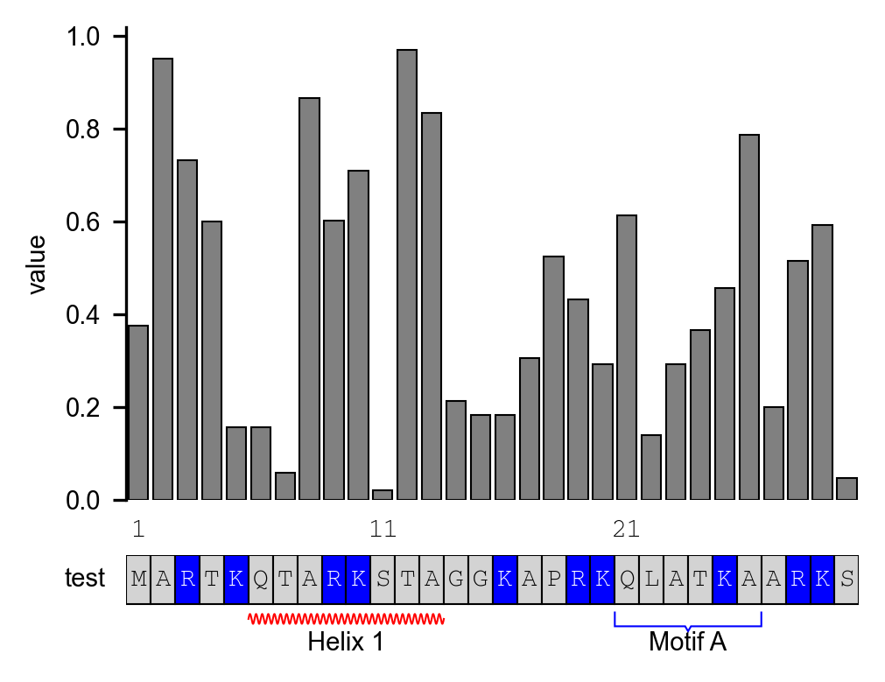

## Overview

This directory includes ensential scripts that used to generate or process data.

File paths in example usages were provided just for reference, please modify the path to the files in your filesystem.

If you countered problems while using these scripts or doubts outside these provided scripts, please contact via e-mail jiangzj6@mail2.sysu.edu.cn or open issue on https://github.com/JuseTiZ/RDHGs_mutation_analysis/issues.

### associate_run.py


### calculate_1-3-mer_mt.py

This script calculates mutation spectra (1-mer and 3-mer contexts) for genomic regions defined in BED files. It analyzes variant data from VCF files and computes mutation counts while considering sequence context and strand information.

**Example usage:**

```
python calculate_1-3-mer_mt.py \
    --genome hg38.fa \
    --max_af 0.0001 \
    --bed human.repli-dep-histone_transcript.4dsite.no_transcript_conflict.filter_bl.bed \
    --name repli-dep-histone_transcript_af1e-4 \
    --contain_strand \
    --output_path result/mutation_asymmetry_info/4dsite/human \
    --vcf gnomadv4.all_snv.vcf.gz
```

**Parameters:**

- `--genome`: Path to the reference genome FASTA file. Chromosome naming must match the VCF and BED files.
- `--max_af`: Maximum allele frequency threshold. Variants with AF higher than this are masked.
- `--bed`: One or more BED files containing genomic regions of interest.
- `--name`: Custom names for output files, corresponding to the BED files. If omitted, the script will automatically use each BED file's basename.
- `--contain_strand`: *Optional*. If set, read the strand column (4th) from BED file and count strand-specific mutations.
- `--output_path`: Output directory for result files. Default is the current directory (`.`).
- `--vcf`: Input VCF file (bgzipped and indexed) containing SNV data.

For complete parameter details, run: `python calculate_1-3-mer_mt.py -h`


### calcu_transcript_feature.py

This script calculates transcript-level features from BigWig files for annotated genomic regions. It extracts quantitative values (e.g., conservation scores, mutation density) from BigWig tracks across transcript features defined in GTF annotation files.

**Example usage:**

```
python calcu_transcript_feature.py \
    --gtffile gencode.v44.basic.annotation.Ensembl_canonical.autosomes.gtf \
    --bigwig \
    hg38.phyloP100way.bw \
    hg38.phastCons100way.bw \
    gerp_conservation_scores.homo_sapiens.GRCh38.bw \
    --bigwigname \
    phyloP100way \
    phastCons100way \
    GERP \
    --include_genetype protein_coding --include_region exon \
    --output human.gencodeV44.pc_canonical.exon_conservation_score.tsv
```

**Parameters:**

- `--gtffile`: Path to the GTF file used for transcript annotation.
- `--bigwig`: One or more BigWig files from which per-base values will be extracted.
- `--bigwigname`: Corresponding names for the BigWig files (**must match in number with --bigwig**).
- `--include_genetype`: List of gene types (from the GTF attribute gene_type or gene_biotype) to include in the analysis, e.g., protein_coding.
- `--include_region`: GTF region types to include in calculations. Typical choices: `exon`, `CDS`, or `transcript`.
- `--output`: Path to the output file containing per-transcript feature statistics.

For complete parameter details, run: `python calcu_transcript_feature.py -h`

### get_4dsite.py

This script identifies four-fold degenerate (4D) sites based on a given GTF annotation and genome FASTA file.

If a genomic position is four-fold degenerate in one transcript but not in another, the position will be excluded (conflict sites are removed).

**Example usage:**

```
python scripts/utils/get_4dsite.py \
    --gtffile gencode.v44.basic.annotation.Ensembl_canonical.autosomes.gtf \
    --genome hg38.fa \
    --valid_pc gencode.v44.pc_translations.fa.gz \
    --output_pep \
    --output human.gencodeV44.basic.absolute_4dsite.bed
```

**Parameters:**

- `--gtffile`: Path to the GTF file used for transcript annotation.
- `--genome`: Path to the genome FASTA file (must match chromosome naming convention with the GTF).
- `--valid_pc`: *Optional FASTA file of validated protein-coding sequences*. If provided, each reconstructed CDS will be translated and compared to the sequence in this file. Transcripts with mismatched translations will be skipped.
- `--output_pep`: *Optional*. If set, output reconstructed CDS and translated protein sequences to FASTA files.
- `--output`: Output file path for 4D site coordinates (in BED format).

For complete parameter details, run: `python get_4dsite.py -h`

### plot_structure.py

This script provides a set of visualization utilities for protein structure and sequence annotation, integrating both secondary structure parsing (via DSSP and mmCIF files) and highly customizable peptide/sequence plotting using Matplotlib.

| Main function                      | Purpose                                                                                                                      |
| ----------------------------- | ---------------------------------------------------------------------------------------------------------------------------- |
| `get_structure()`             | Extracts helix and sheet intervals from mmCIF files using DSSP, automatically recognizing histone families (H1–H4).          |
| `plot_peptide_sequence()`     | Generates a customizable peptide sequence diagram with annotations, color-coded residue properties, and optional bar graphs. |
| `merge_intervals()`           | Utility to merge consecutive residue indices into interval ranges.                                                           |

**Example Usage:**

```
from plot_structure import plot_peptide_sequence
import matplotlib.pyplot as plt
import numpy as np

sequence = "MARTKQTARKSTAGGKAPRKQLATKAARKS"
annotations = [
    {"label": "Helix 1", "range": (5, 12), "style": "helix", "color": "red"},
    {"label": "Motif A", "range": (20, 25), "style": "brace", "color": "blue"},
]

values = np.random.rand(len(sequence))

plt.figure(figsize=(5, 2))

plot_peptide_sequence(
    seq=sequence,
    seq_label="test",
    annotations=annotations,
    values=values,
    bar_label="value",
    height_ratios=[6, 1],
)
```



For advanced usage, see `figures/Fig3/fig3_c.ipynb`